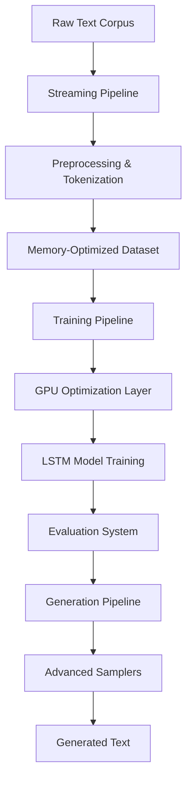

# 🏗️ Robo-Poet Architecture Overview

## Project Structure & Design Philosophy

The Robo-Poet project follows a **layered enterprise architecture** with **Domain-Driven Design (DDD)** principles, specifically optimized for text generation with LSTM models on RTX 2000 Ada hardware.

## 📁 Project Structure

```
robo-poet/
├── src/
│   ├── domain/              # Core business logic (DDD)
│   │   ├── entities/        # Core domain entities
│   │   ├── events/          # Domain events
│   │   └── exceptions/      # Domain-specific exceptions
│   ├── application/         # Application services (DDD)
│   │   ├── commands/        # Command pattern implementation
│   │   ├── services/        # Application services
│   │   └── queries/         # CQRS query handlers
│   ├── infrastructure/      # Infrastructure layer (DDD)
│   │   ├── repositories/    # Data persistence
│   │   ├── messaging/       # Event handling
│   │   └── configuration/   # Dependency injection
│   ├── interface/           # User interface layer
│   │   ├── cli/            # Command line interface
│   │   └── menu_system.py  # Interactive menu
│   ├── gpu_optimization/    # Strategy 4: Professional GPU config
│   │   ├── mixed_precision.py     # FP16/FP32 training
│   │   ├── tensor_cores.py        # RTX 2000 Ada optimization
│   │   ├── memory_manager.py      # Dynamic memory management
│   │   ├── adaptive_batch.py      # Intelligent batch sizing
│   │   └── benchmark.py           # Performance testing
│   ├── generation/          # Strategy 5: Advanced text generation
│   │   ├── samplers.py            # Top-k, Nucleus, Beam Search
│   │   ├── temperature_scheduler.py # Dynamic temperature control
│   │   └── advanced_generator.py  # Unified generation interface
│   ├── data/               # Strategy 6: Professional data pipeline
│   │   ├── streaming.py           # tf.data streaming pipeline
│   │   ├── augmentation.py        # Text augmentation techniques
│   │   ├── validation.py          # K-fold cross validation
│   │   ├── preprocessing.py       # Multi-strategy tokenization
│   │   └── memory_optimizer.py    # Memory-efficient processing
│   ├── evaluation/         # Strategy 3: Continuous evaluation
│   │   ├── metrics.py             # BLEU, ROUGE, Perplexity
│   │   ├── monitor.py             # Real-time monitoring
│   │   ├── dashboard.py           # TensorBoard integration
│   │   └── early_stopping.py     # Multi-metric early stopping
│   └── core/               # Legacy core components
│       ├── model.py               # LSTM model definition
│       ├── orchestrator.py        # Training orchestration
│       └── data_processor.py      # Basic data processing
├── tests/                  # Test suites
│   ├── test_gpu_optimization.py
│   ├── test_generation_system.py
│   └── test_data_pipeline.py
├── config/                 # Configuration files
└── docs/                   # Documentation
```

## 🎯 Architecture Layers

### 1. **Domain Layer** (Core Business Logic)
- **Entities**: `TextCorpus`, `GenerationModel`, `TrainingSession`
- **Value Objects**: `ModelConfig`, `GenerationParams`, `TrainingMetrics`
- **Domain Events**: `TrainingStarted`, `TrainingCompleted`, `GenerationRequested`
- **Aggregates**: Encapsulate business rules and invariants

### 2. **Application Layer** (Use Cases)
- **Commands**: `TrainModelCommand`, `GenerateTextCommand`
- **Services**: `TrainingService`, `GenerationService`, `EvaluationService`
- **Queries**: `GetTrainingHistoryQuery`, `GetModelMetricsQuery`

### 3. **Infrastructure Layer** (Technical Details)
- **Repositories**: Data persistence with SQLAlchemy
- **Message Bus**: Event handling and communication
- **Dependency Injection**: Service container configuration

### 4. **Interface Layer** (User Interaction)
- **CLI Interface**: Command-line tools with Typer
- **Menu System**: Interactive user interface
- **API Endpoints**: RESTful API with FastAPI

## ⚡ Key Design Patterns

### 1. **Domain-Driven Design (DDD)**
```python
# Domain Entity
@dataclass
class GenerationModel:
    id: ModelId
    name: str
    config: ModelConfig
    metrics: TrainingMetrics
    
    def train(self, corpus: TextCorpus) -> None:
        # Business logic here
        self._publish_event(TrainingStarted(self.id))
```

### 2. **Command Pattern**
```python
class TrainModelCommand:
    def __init__(self, model_config: ModelConfig, corpus_path: str):
        self.model_config = model_config
        self.corpus_path = corpus_path

class TrainModelHandler:
    def handle(self, command: TrainModelCommand) -> TrainingResult:
        # Command execution logic
```

### 3. **Repository Pattern**
```python
class ModelRepository(Protocol):
    def save(self, model: GenerationModel) -> None: ...
    def find_by_id(self, model_id: ModelId) -> Optional[GenerationModel]: ...
```

### 4. **Strategy Pattern** (Generation Methods)
```python
class GenerationStrategy(ABC):
    @abstractmethod
    def generate(self, prompt: str, config: GenerationConfig) -> str: ...

class NucleusSampler(GenerationStrategy): ...
class BeamSearchSampler(GenerationStrategy): ...
```

## 🔧 Technology Stack

### **Core Technologies**
- **Python 3.10+**: Primary language
- **TensorFlow 2.20+**: Deep learning framework
- **CUDA 12.2**: GPU acceleration
- **SQLAlchemy**: ORM for data persistence
- **Pydantic**: Data validation and settings

### **GPU Optimization**
- **Mixed Precision**: FP16/FP32 training for RTX 2000 Ada
- **Tensor Cores**: 4th generation optimization
- **Dynamic Memory**: Intelligent VRAM management (8GB GDDR6)
- **Adaptive Batching**: Real-time batch size optimization

### **Data Pipeline**
- **tf.data**: High-performance data loading
- **Text Augmentation**: 8 semantic-preserving techniques
- **Memory Optimization**: Real-time monitoring and adaptive resource management
- **Cross Validation**: K-fold, stratified, and temporal validation

### **Generation System**
- **Multiple Samplers**: Greedy, Temperature, Top-k, Nucleus, Beam Search
- **Dynamic Scheduling**: 6 temperature scheduling algorithms
- **Style Conditioning**: Targeted generation control
- **Quality Metrics**: Diversity tracking and repetition control

## 📊 Data Flow Architecture



## 🎯 Design Principles

### 1. **Separation of Concerns**
- Each layer has distinct responsibilities
- Business logic isolated from technical implementation
- Clear interfaces between components

### 2. **Dependency Injection**
- All dependencies injected via constructor
- Easy testing and configuration
- Loose coupling between components

### 3. **Event-Driven Architecture**
- Domain events for decoupled communication
- Asynchronous processing capabilities
- Audit trail and monitoring

### 4. **SOLID Principles**
- **Single Responsibility**: Each class has one reason to change
- **Open/Closed**: Open for extension, closed for modification
- **Liskov Substitution**: Subtypes must be substitutable
- **Interface Segregation**: Clients depend only on needed interfaces
- **Dependency Inversion**: Depend on abstractions, not concretions

## 🔄 Development Workflow

### 1. **Strategy Implementation Pattern**
Each strategy follows a consistent pattern:
- **Core Implementation**: Main functionality
- **Configuration**: Type-safe configuration classes
- **Testing**: Comprehensive test coverage
- **Documentation**: Clear usage examples

### 2. **Error Handling**
```python
# Custom exception hierarchy
class RoboPoetError(Exception): pass
class GPUError(RoboPoetError): pass
class TrainingError(RoboPoetError): pass
class GenerationError(RoboPoetError): pass
```

### 3. **Logging Strategy**
- Structured logging with contextual information
- Different log levels for different audiences
- Performance metrics and debugging information

## 🚀 Performance Characteristics

### **GPU Optimization**
- **Memory Efficiency**: Dynamic growth with 8GB GDDR6 optimization
- **Compute Optimization**: Tensor Cores utilization for 2x speedup
- **Batch Optimization**: Real-time adjustment based on memory pressure

### **Data Processing**
- **Streaming**: Handles large corpora without memory overflow
- **Augmentation**: 8 techniques preserving semantic coherence
- **Validation**: Efficient k-fold cross-validation with stratification

### **Generation Quality**
- **Multiple Strategies**: 5 sampling methods with fine-grained control
- **Dynamic Control**: Temperature scheduling for optimal creativity/coherence balance
- **Quality Metrics**: Comprehensive evaluation with diversity and repetition tracking

## 🔮 Future Architecture Evolution

### **Phase 3: Enterprise Features**
- Microservices architecture with FastAPI
- Distributed training with model parallelism
- Real-time monitoring and alerting
- Container orchestration with Docker/Kubernetes

### **Phase 4: Production Deployment**
- CI/CD pipeline with automated testing
- Blue-green deployment strategies
- Performance monitoring and optimization
- Security hardening and compliance

## 📈 Scalability Considerations

### **Horizontal Scaling**
- Model serving with multiple GPUs
- Data pipeline parallelization
- Distributed evaluation system

### **Vertical Scaling**
- Multi-GPU training support
- Memory-efficient model variants
- Optimized inference pipelines

---

This architecture provides a **solid foundation** for both **educational purposes** and **production deployment**, with clear separation of concerns, comprehensive testing, and professional-grade optimization for RTX 2000 Ada hardware.