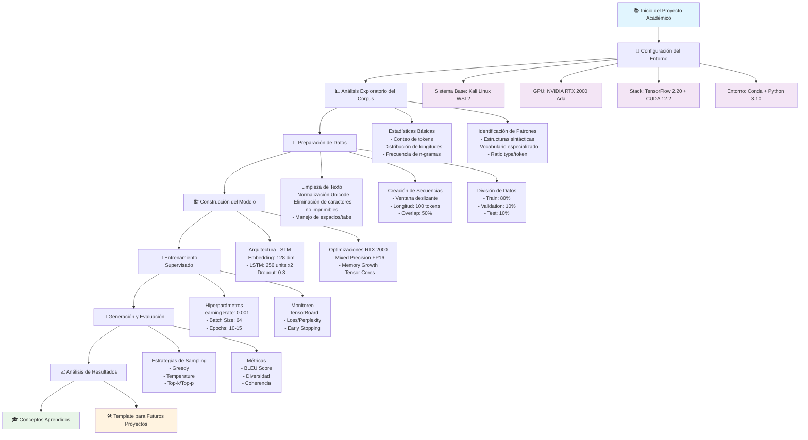

# robo-poet - Generador de Texto con TensorFlow

Implementación educacional de un generador de texto basado en LSTM usando TensorFlow 2.20, optimizado para GPUs NVIDIA RTX 2000 Ada con Kali Linux en WSL2.

## 🚀 Inicio Rápido

```bash
# Activar entorno conda
eval "$($HOME/miniconda3/bin/conda shell.bash hook)"       
conda activate robo-poet-gpu

# Configurar variables CUDA
export CUDA_HOME=$CONDA_PREFIX
export LD_LIBRARY_PATH=$CONDA_PREFIX/lib:$LD_LIBRARY_PATH

# Ejecutar robo-poet
python robo_poet.py --text "The+48+Laws+Of+Power_texto.txt" --epochs 5
```

## Flujo Académico del Proyecto



## Marco Académico y Metodológico

Este proyecto sirve como un **template educacional completo** para el desarrollo de proyectos de Machine Learning en entornos Linux especializados como Kali Linux. La metodología implementada abarca desde los fundamentos teóricos hasta la optimización práctica en hardware específico.

### Conceptos Académicos Cubiertos

- **Arquitecturas de Redes Neuronales**: LSTM, Embeddings, y fundamentos de Transformers
- **Optimización de GPU**: Mixed Precision, Tensor Cores, y gestión de memoria VRAM
- **Procesamiento de Lenguaje Natural**: Tokenización, vocabulario, y métricas de evaluación
- **Ingeniería de Software**: Entornos virtuales, control de versiones, y debugging sistemático
- **Sistemas Linux**: Configuración de drivers, gestión de dependencias, y troubleshooting

### Template para Proyectos en Kali Linux

Esta implementación establece un **patrón replicable** para proyectos de ML en Kali Linux que incluye:

1. **Stack Tecnológico Verificado**: Combinación probada de conda + CUDA + TensorFlow
2. **Metodología de Configuración**: Scripts automatizados para setup del entorno GPU
3. **Flujo de Desarrollo**: Desde análisis exploratorio hasta evaluación de modelos
4. **Herramientas de Debugging**: Verificación sistemática de componentes del sistema
5. **Optimizaciones Específicas**: Configuraciones adaptadas para hardware NVIDIA en WSL2

## Requisitos del Sistema

### Hardware Mínimo
- **GPU**: NVIDIA RTX 2000 Ada o superior (8GB VRAM)
- **RAM**: 16GB DDR4/DDR5
- **Almacenamiento**: 10GB espacio libre (modelo + datasets)
- **CPU**: Intel i5-8400 / AMD Ryzen 5 2600 o superior

### Software Requerido (Configuración Probada)
- **OS**: Kali Linux en WSL2 (Windows 11)
- **Python**: 3.10.18 (conda environment)
- **TensorFlow**: 2.20.0
- **CUDA Toolkit**: 12.2.140 (conda-forge)
- **cuDNN**: Incluido en conda environment
- **NVIDIA Driver**: 566.24 (Windows host)
- **Conda**: 25.5.1 (Miniconda3)

### Dependencias Python (Stack Verificado)
```
tensorflow==2.20.0
cudatoolkit=12.0 (conda-forge)
cudnn (conda-forge)
numpy (latest compatible)
matplotlib (latest)
tqdm (latest)
```

## Configuración para Kali Linux WSL2 + NVIDIA RTX 2000 Ada (MÉTODO VERIFICADO)

### Paso 1: Preparación del Sistema WSL2

```bash
# WSL2 no requiere headers del kernel, usa driver de Windows
# Verificar que nvidia-smi funciona desde WSL2
nvidia-smi

# Debe mostrar:
# NVIDIA RTX 2000 Ada Generation Laptop GPU, Driver Version: 566.24
```

### Paso 2: Instalación de Miniconda (REQUERIDO)

```bash
# Descargar e instalar Miniconda
wget https://repo.anaconda.com/miniconda/Miniconda3-latest-Linux-x86_64.sh
bash Miniconda3-latest-Linux-x86_64.sh -b -p $HOME/miniconda3

# Activar conda en shell actual
eval "$($HOME/miniconda3/bin/conda shell.bash hook)"

# Verificar instalación
conda --version  # Debe mostrar: conda 25.5.1
```

### Paso 3: Crear Entorno Python con CUDA (MÉTODO QUE FUNCIONA)

```bash
# Crear entorno con Python 3.10
conda create -n robo-poet-gpu python=3.10 -y
conda activate robo-poet-gpu

# Instalar CUDA Toolkit y cuDNN desde conda-forge
conda install -c conda-forge cudatoolkit=12.0 cudnn -y

# Verificar CUDA disponible
nvcc --version
# Debe mostrar: Cuda compilation tools, release 12.2, V12.2.140
```

### Paso 4: Instalación de TensorFlow con GPU

```bash
# Con el entorno activado (robo-poet-gpu)
pip install tensorflow==2.20.0

# Instalar dependencias adicionales
pip install numpy matplotlib tqdm tensorboard

# Verificar que GPU es detectada
python -c "import tensorflow as tf; print('GPUs:', tf.config.list_physical_devices('GPU'))"
# Debe mostrar: GPUs: [PhysicalDevice(name='/physical_device:GPU:0', device_type='GPU')]
```

### Paso 5: Configuración del Entorno Python

```bash
# Instalar Python 3.10 si no está disponible
sudo apt install -y python3.10 python3.10-venv python3.10-dev

# Crear directorio del proyecto
mkdir -p ~/projects/robo-poet
cd ~/projects/robo-poet

# Crear entorno virtual
python3.10 -m venv venv
source venv/bin/activate

# Actualizar pip y herramientas base
pip install --upgrade pip setuptools wheel

# Configurar pip para evitar timeouts
pip config set global.timeout 120
```

### Paso 6: Instalación de TensorFlow con GPU

```bash
# Instalar TensorFlow
pip install tensorflow==2.15.0

# Si hay problemas con tensorrt, instalar sin las extensiones extra
pip install tensorflow==2.15.0 --no-deps
pip install absl-py astunparse flatbuffers gast google-pasta grpcio h5py keras \
    libclang ml-dtypes numpy opt-einsum packaging protobuf setuptools \
    six tensorboard tensorflow-estimator tensorflow-io-gcs-filesystem \
    termcolor typing-extensions wrapt

# Instalar dependencias del proyecto
pip install numpy==1.24.3 tqdm==4.66.1 matplotlib==3.7.2 tensorboard==2.15.0

# Verificar GPU es detectada
python -c "import tensorflow as tf; print(f'GPUs disponibles: {tf.config.list_physical_devices(\"GPU\")}')"
```

## Verificación de Instalación (Configuración Actual)

### Configuración Verificada y Funcionando
```bash
# Estado actual del sistema:
Python: 3.10.18 (conda environment)
TensorFlow: 2.20.0 
CUDA Toolkit: 12.2.140
GPU: NVIDIA RTX 2000 Ada Generation Laptop GPU
Driver: 566.24
Conda: 25.5.1
Mixed Precision: Activable para Tensor Cores
```

### Verificación Rápida
```bash
# Activar entorno
conda activate robo-poet-gpu

# Verificar que todo funciona
python -c "
import tensorflow as tf
import sys
print('Python:', sys.version.split()[0])
print('TensorFlow:', tf.__version__)
print('CUDA disponible:', tf.test.is_built_with_cuda())
gpus = tf.config.list_physical_devices('GPU')
print(f'GPUs detectadas: {len(gpus)}')
if gpus:
    print('✓ ¡Tu RTX 2000 Ada está funcionando!')
else:
    print('✗ GPU no detectada')
"
```

### Script de Verificación Completa

```bash
# Crear archivo verify_setup.py
cat > verify_setup.py << 'EOF'
#!/usr/bin/env python3
"""
Verificación completa de instalación GPU para robo-poet en Kali Linux
"""

import sys
import os
import subprocess

def check_system_info():
    """Verifica información del sistema"""
    print("=" * 60)
    print("INFORMACIÓN DEL SISTEMA")
    print("=" * 60)
    
    # Verificar distribución
    try:
        with open('/etc/os-release', 'r') as f:
            for line in f:
                if line.startswith('PRETTY_NAME'):
                    print(f"OS: {line.split('=')[1].strip().strip('\"')}")
                    break
    except:
        print("OS: No se pudo determinar")
    
    # Verificar kernel
    kernel = subprocess.run(['uname', '-r'], capture_output=True, text=True)
    print(f"Kernel: {kernel.stdout.strip()}")
    
    # Verificar Python
    print(f"Python: {sys.version}")

def check_nvidia_driver():
    """Verifica driver NVIDIA"""
    print("\n" + "=" * 60)
    print("NVIDIA DRIVER")
    print("=" * 60)
    
    try:
        result = subprocess.run(['nvidia-smi', '--query-gpu=name,driver_version,memory.total',
                               '--format=csv,noheader'], capture_output=True, text=True)
        if result.returncode == 0:
            gpu_info = result.stdout.strip().split(', ')
            print(f"✓ GPU: {gpu_info[0]}")
            print(f"✓ Driver Version: {gpu_info[1]}")
            print(f"✓ VRAM: {gpu_info[2]}")
        else:
            print("✗ nvidia-smi falló")
            return False
    except FileNotFoundError:
        print("✗ nvidia-smi no encontrado - instalar driver NVIDIA")
        return False
    
    return True

def check_cuda():
    """Verifica instalación de CUDA"""
    print("\n" + "=" * 60)
    print("CUDA TOOLKIT")
    print("=" * 60)
    
    try:
        result = subprocess.run(['nvcc', '--version'], capture_output=True, text=True)
        if result.returncode == 0:
            for line in result.stdout.split('\n'):
                if 'release' in line:
                    print(f"✓ CUDA Version: {line.strip()}")
                    break
        else:
            print("✗ nvcc falló")
            return False
    except FileNotFoundError:
        print("✗ nvcc no encontrado - verificar PATH o instalar CUDA")
        print("  export PATH=/usr/local/cuda-11.8/bin:$PATH")
        return False
    
    # Verificar libcudart
    cuda_lib = "/usr/local/cuda-11.8/lib64/libcudart.so"
    if os.path.exists(cuda_lib):
        print(f"✓ CUDA Runtime Library: {cuda_lib}")
    else:
        print(f"✗ CUDA Runtime Library no encontrada en {cuda_lib}")
        return False
    
    return True

def check_cudnn():
    """Verifica instalación de cuDNN"""
    print("\n" + "=" * 60)
    print("cuDNN")
    print("=" * 60)
    
    cudnn_header = "/usr/local/cuda-11.8/include/cudnn_version.h"
    if os.path.exists(cudnn_header):
        print(f"✓ cuDNN header encontrado: {cudnn_header}")
        # Intentar leer versión
        try:
            with open(cudnn_header, 'r') as f:
                for line in f:
                    if '#define CUDNN_MAJOR' in line:
                        major = line.split()[-1]
                    elif '#define CUDNN_MINOR' in line:
                        minor = line.split()[-1]
                    elif '#define CUDNN_PATCHLEVEL' in line:
                        patch = line.split()[-1]
                        print(f"✓ cuDNN Version: {major}.{minor}.{patch}")
                        break
        except:
            print("  No se pudo leer la versión")
    else:
        print(f"✗ cuDNN no encontrado en {cudnn_header}")
        return False
    
    return True

def check_tensorflow():
    """Verifica TensorFlow con GPU"""
    print("\n" + "=" * 60)
    print("TENSORFLOW GPU")
    print("=" * 60)
    
    try:
        import tensorflow as tf
        print(f"✓ TensorFlow Version: {tf.__version__}")
        
        # Verificar compilación con CUDA
        print(f"✓ Built with CUDA: {tf.test.is_built_with_cuda()}")
        
        # Verificar GPUs
        gpus = tf.config.list_physical_devices('GPU')
        if gpus:
            print(f"✓ GPUs detectadas: {len(gpus)}")
            for gpu in gpus:
                print(f"  - {gpu.name}")
            
            # Test de operación
            with tf.device('/GPU:0'):
                a = tf.constant([[1.0, 2.0], [3.0, 4.0]])
                b = tf.constant([[1.0, 1.0], [0.0, 1.0]])
                c = tf.matmul(a, b)
                print(f"✓ Test de operación matricial exitoso")
            
            # Mixed precision
            try:
                policy = tf.keras.mixed_precision.Policy('mixed_float16')
                tf.keras.mixed_precision.set_global_policy(policy)
                print("✓ Mixed precision (FP16) disponible")
            except:
                print("⚠ Mixed precision no disponible")
            
            return True
        else:
            print("✗ No se detectaron GPUs")
            print("\nPosibles soluciones:")
            print("1. Verificar driver NVIDIA: nvidia-smi")
            print("2. Verificar CUDA_VISIBLE_DEVICES no esté vacío")
            print("3. Reinstalar TensorFlow: pip install --upgrade --force-reinstall tensorflow==2.15.0")
            return False
            
    except ImportError as e:
        print(f"✗ TensorFlow no instalado: {e}")
        return False
    except Exception as e:
        print(f"✗ Error en TensorFlow: {e}")
        return False

def main():
    """Ejecuta todas las verificaciones"""
    print("\n" + "=" * 60)
    print("VERIFICACIÓN DE CONFIGURACIÓN ROBO-POET")
    print("Sistema: Kali Linux + NVIDIA GPU")
    print("=" * 60)
    
    checks = [
        ("Sistema", check_system_info),
        ("NVIDIA Driver", check_nvidia_driver),
        ("CUDA Toolkit", check_cuda),
        ("cuDNN", check_cudnn),
        ("TensorFlow GPU", check_tensorflow)
    ]
    
    results = []
    for name, check_func in checks:
        try:
            result = check_func()
            if result is not False:
                results.append((name, True))
            else:
                results.append((name, False))
        except Exception as e:
            print(f"Error en {name}: {e}")
            results.append((name, False))
    
    # Resumen
    print("\n" + "=" * 60)
    print("RESUMEN DE VERIFICACIÓN")
    print("=" * 60)
    
    all_passed = True
    for name, passed in results:
        if name != "Sistema":  # Sistema no retorna True/False
            status = "✓ PASS" if passed else "✗ FAIL"
            print(f"{name:20} {status}")
            if not passed:
                all_passed = False
    
    if all_passed:
        print("\n✓ ¡Configuración completa exitosa!")
        print("  Puedes comenzar a usar robo-poet")
    else:
        print("\n✗ Hay componentes que requieren atención")
        print("  Revisa los mensajes anteriores para soluciones")
    
    return 0 if all_passed else 1

if __name__ == "__main__":
    sys.exit(main())
EOF

# Ejecutar verificación
chmod +x verify_setup.py
python verify_setup.py
```

## Uso Básico

### Estructura del Proyecto

```
robo-poet/
├── data/
│   ├── raw/           # Textos originales (.txt)
│   ├── processed/     # Datos preprocesados
│   └── vocab/         # Vocabulario y tokenizer
├── models/
│   ├── checkpoints/   # Checkpoints durante entrenamiento
│   └── final/         # Modelo final entrenado
├── src/
│   ├── preprocessing.py
│   ├── model.py
│   ├── train.py
│   └── generate.py
├── logs/              # TensorBoard logs
├── scripts/           # Scripts auxiliares
│   └── setup_gpu.sh   # Configuración GPU
└── robo_poet.py      # CLI principal
```

### Comandos CLI

#### Entrenamiento

```bash
# Activar entorno virtual
source venv/bin/activate

# Entrenamiento básico
python robo_poet.py train --data data/raw/texto.txt

# Entrenamiento con parámetros personalizados
python robo_poet.py train \
    --data data/raw/texto.txt \
    --epochs 10 \
    --batch-size 32 \
    --learning-rate 0.001 \
    --lstm-units 256 \
    --embedding-dim 128 \
    --checkpoint-dir models/checkpoints
```

#### Generación de Texto

```bash
# Generación simple
python robo_poet.py generate \
    --model models/final/model.h5 \
    --seed "En un lugar" \
    --length 200 \
    --temperature 0.8

# Modo interactivo
python robo_poet.py generate --model models/final/model.h5 --interactive
```

#### Monitoreo con TensorBoard

```bash
# En terminal separada
tensorboard --logdir logs --port 6006 --bind_all

# Acceder desde navegador
# http://localhost:6006
# O desde otra máquina: http://[IP-DE-KALI]:6006
```

## Preparación de Datos

### Descarga de Datasets de Ejemplo

```bash
# Literatura en español (Quijote)
wget https://www.gutenberg.org/files/2000/2000-0.txt -O data/raw/quijote.txt

# Código Python
git clone --depth 1 https://github.com/tensorflow/models.git temp/
find temp/ -name "*.py" -exec cat {} \; > data/raw/python_code.txt
rm -rf temp/

# Conversión de encoding si es necesario
iconv -f ISO-8859-1 -t UTF-8 data/raw/quijote.txt -o data/raw/quijote_utf8.txt
```

## Optimización de Rendimiento en Linux

### Configuración del Sistema

```bash
# Configuración de GPU para máximo rendimiento
sudo nvidia-smi -pm 1  # Persistence mode
sudo nvidia-smi -pl 140  # Power limit (ajustar según GPU)

# Deshabilitar CPU frequency scaling para consistencia
echo performance | sudo tee /sys/devices/system/cpu/cpu*/cpufreq/scaling_governor

# Aumentar límites del sistema
ulimit -n 65536  # File descriptors
ulimit -u 32768  # Procesos de usuario
```

### Script de Configuración GPU

```bash
# Crear scripts/setup_gpu.sh
cat > scripts/setup_gpu.sh << 'EOF'
#!/bin/bash
# Configuración óptima de GPU para entrenamiento

echo "Configurando GPU para máximo rendimiento..."

# Verificar GPU disponible
if ! nvidia-smi &> /dev/null; then
    echo "Error: nvidia-smi no disponible"
    exit 1
fi

# Establecer persistence mode
sudo nvidia-smi -pm 1

# Configurar power limit (ajustar según GPU)
# RTX 2000 Ada típicamente 70-140W
sudo nvidia-smi -pl 140

# Configurar compute mode exclusivo (opcional)
# sudo nvidia-smi -c EXCLUSIVE_PROCESS

# Mostrar configuración actual
nvidia-smi --query-gpu=name,persistence_mode,power.limit --format=csv

echo "Configuración completa"
EOF

chmod +x scripts/setup_gpu.sh
./scripts/setup_gpu.sh
```

### Variables de Entorno Optimizadas

```bash
# Añadir a ~/.bashrc o ~/.zshrc
export TF_CPP_MIN_LOG_LEVEL=2  # Reducir verbosidad
export TF_FORCE_GPU_ALLOW_GROWTH=true  # Crecimiento dinámico de memoria
export TF_GPU_THREAD_MODE=gpu_private  # Threading optimizado
export TF_CUDNN_DETERMINISTIC=1  # Reproducibilidad
export CUDA_CACHE_MAXSIZE=4294967296  # 4GB cache para kernels

# Optimizaciones XLA
export TF_XLA_FLAGS=--tf_xla_auto_jit=2
export XLA_FLAGS=--xla_gpu_cuda_data_dir=/usr/local/cuda-11.8
```

## Troubleshooting en Kali Linux

### Error: CUDA out of memory

```bash
# Solución 1: Limpiar memoria GPU
sudo nvidia-smi --gpu-reset

# Solución 2: Reducir batch size
python robo_poet.py train --batch-size 16

# Solución 3: Monitorear uso de memoria
watch -n 0.5 nvidia-smi
```

### Error: Could not load dynamic library 'libcudnn.so.8'

```bash
# Verificar librería existe
find /usr -name "libcudnn.so.8" 2>/dev/null

# Crear symlink si es necesario
sudo ln -s /usr/local/cuda-11.8/lib64/libcudnn.so.8.6.0 /usr/local/cuda-11.8/lib64/libcudnn.so.8

# Actualizar cache de librerías
sudo ldconfig

# Verificar
ldconfig -p | grep cudnn
```

### Error: Permission denied para GPU

```bash
# Añadir usuario al grupo video
sudo usermod -a -G video $USER

# Verificar permisos de dispositivos
ls -la /dev/nvidia*

# Si es necesario, ajustar permisos
sudo chmod 666 /dev/nvidia*

# Reiniciar sesión
logout
```

### Error: Conflicto con nouveau driver

```bash
# Verificar si nouveau está cargado
lsmod | grep nouveau

# Si está presente, blacklist más agresivo
echo "blacklist nouveau" | sudo tee /etc/modprobe.d/blacklist-nouveau.conf
echo "options nouveau modeset=0" | sudo tee -a /etc/modprobe.d/blacklist-nouveau.conf
echo "alias nouveau off" | sudo tee -a /etc/modprobe.d/blacklist-nouveau.conf

# Regenerar initramfs
sudo update-initramfs -u
sudo reboot
```

### Monitoreo de Recursos

```bash
# GPU monitoring
nvidia-smi dmon -s pucvmet -d 1

# Alternativa: nvtop (más visual)
sudo apt install nvtop
nvtop

# Profiling detallado
nvidia-smi --query-gpu=timestamp,name,pci.bus_id,driver_version,pstate,pcie.link.gen.max,pcie.link.gen.current,temperature.gpu,utilization.gpu,utilization.memory,memory.total,memory.free,memory.used --format=csv -l 1
```

## Benchmarks Esperados

Con configuración óptima en RTX 2000 Ada (Kali Linux):

| Métrica | Valor |
|---------|-------|
| Tokens/segundo (training) | 18,000-22,000 |
| Batch size máximo | 32 (seq_len=100) |
| Tiempo/época (10MB dataset) | 7-10 minutos |
| Memoria GPU utilizada | 6.2-7.3 GB |
| Temperatura GPU | 65-75°C |
| Power draw | 120-140W |

## Seguridad y Mejores Prácticas

### Aislamiento del Entorno

```bash
# Usar entornos virtuales siempre
python -m venv venv --system-site-packages=false

# No ejecutar con sudo a menos que sea necesario
# Usar --user para instalaciones locales si no hay venv
pip install --user tensorflow==2.15.0
```

### Backup de Modelos

```bash
# Script de backup automático
cat > scripts/backup_model.sh << 'EOF'
#!/bin/bash
TIMESTAMP=$(date +%Y%m%d_%H%M%S)
BACKUP_DIR="backups/model_${TIMESTAMP}"
mkdir -p "$BACKUP_DIR"
cp -r models/final/* "$BACKUP_DIR/"
echo "Backup creado en $BACKUP_DIR"
EOF

chmod +x scripts/backup_model.sh
```

## Recursos Adicionales

### Documentación
- [TensorFlow GPU Support](https://www.tensorflow.org/install/gpu)
- [NVIDIA CUDA on Linux](https://docs.nvidia.com/cuda/cuda-installation-guide-linux/)
- [Kali Linux NVIDIA Drivers](https://www.kali.org/docs/general-use/install-nvidia-drivers-on-kali-linux/)

### Herramientas Útiles
- `nvtop`: Monitor GPU interactivo
- `gpustat`: Estado GPU en terminal
- `tensorflow-profiler`: Profiling detallado

### Comunidad
- TensorFlow Forum: discuss.tensorflow.org
- NVIDIA Developer Forums: forums.developer.nvidia.com
- Kali Linux Forums: forums.kali.org

## Licencia

MIT License - Proyecto educacional de código abierto.