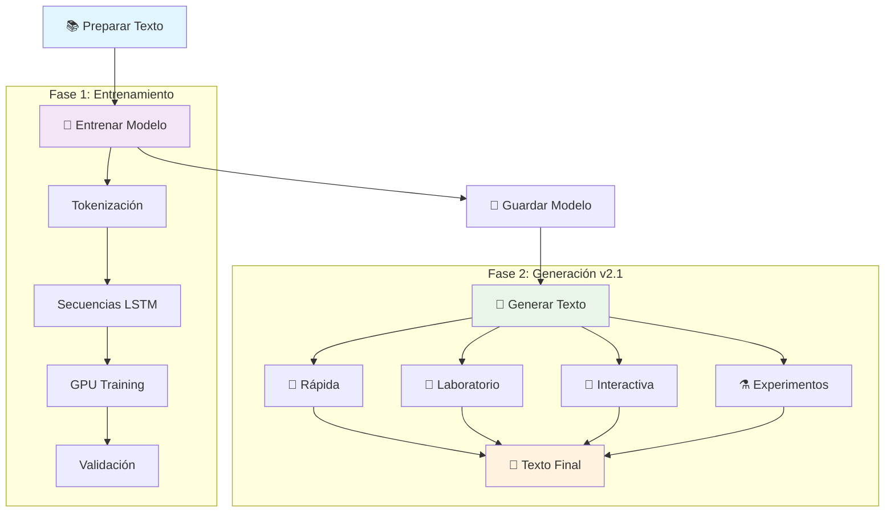
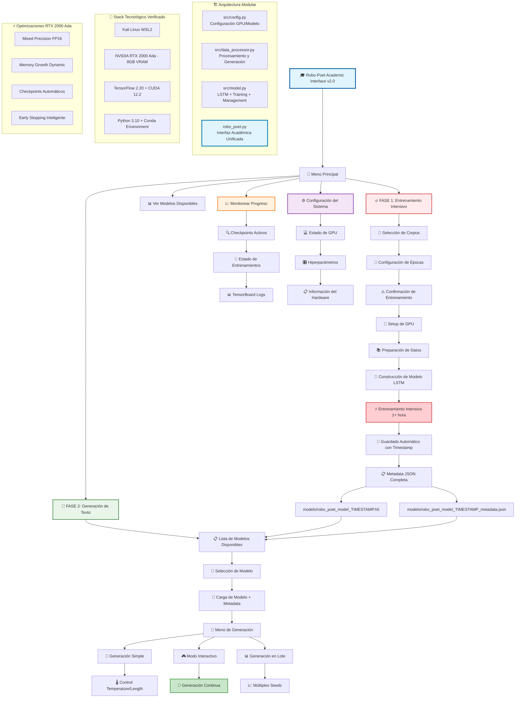

# 🎓 Robo-Poet - Interfaz Académica para Generación de Texto

**Implementación educacional completa** de un generador de texto basado en LSTM usando TensorFlow 2.20, optimizado para GPUs NVIDIA RTX 2000 Ada con Kali Linux en WSL2.

**Nueva Arquitectura v2.0**: Interfaz académica unificada con sistema de dos fases separadas para entrenamiento intensivo y generación de texto.

## 🚀 Inicio Rápido



```bash
# Activar entorno conda
eval "$($HOME/miniconda3/bin/conda shell.bash hook)"       
conda activate robo-poet-gpu

# MÉTODO PRINCIPAL: Interfaz Académica (RECOMENDADO)
python robo_poet.py

# MÉTODO DIRECTO: Entrenamiento específico
python robo_poet.py --text "The+48+Laws+Of+Power_texto.txt" --epochs 10

# MÉTODO RÁPIDO: Scripts auxiliares
./train --epochs 20
./generate --seed "The power of" --length 300
```

## 🎯 Solución WSL2 + GPU Implementada

**PROBLEMA RESUELTO**: El framework incluye **detección automática de GPU para WSL2** que soluciona el error común "Cannot dlopen some GPU libraries".

### ✅ Detección Automática:
- 🔍 **Estrategia 1**: Detección estándar TensorFlow
- 🎯 **Estrategia 2**: Acceso directo GPU (WSL2 workaround) 
- 🔄 **Estrategia 3**: Fallback modo CPU

### 🎉 Resultado Esperado:
```
🎯 ¡GPU funciona perfectamente via acceso directo!
💡 Aplicando workaround WSL2 para usar GPU
✅ Todos los módulos GPU importados correctamente
```

### 🔧 Si Necesitas Instalar Librerías CUDA:
```bash
conda install -c conda-forge cudnn libcublas libcufft libcurand libcusolver libcusparse -y
```

### 🎯 Sistema Avanzado de Dos Fases v2.1

1. **🔥 FASE 1**: Entrenamiento Intensivo (1+ hora) - Crea modelos robustos
2. **🎨 FASE 2**: Estudio de Generación Avanzado - 8 modos de generación con análisis completo

#### 🆕 Nuevas Características FASE 2 v2.1:
- **🚀 Generación Rápida**: 5 presets optimizados (Narrativa, Creativo, Experimental, Académico, Artístico)
- **🔬 Laboratorio Creativo**: Control total con generación dirigida y variaciones
- **🎮 Sesión Interactiva**: Comandos avanzados con estadísticas en tiempo real
- **📊 Experimentos en Lote**: 4 tipos (múltiples seeds, barrido temperature, variación longitud, matriz completa)
- **🎨 Plantillas Temáticas**: 5 estilos literarios predefinidos con seeds optimizados
- **📈 Análisis Avanzado**: Estadísticas detalladas del modelo y recomendaciones de uso
- **💾 Gestión Completa**: Guardado automático con metadata y visualización de archivos

## 🎓 Arquitectura Académica v2.0 - Sistema de Dos Fases



## 🎓 Marco Académico y Metodológico v2.0

Este proyecto representa una **evolución hacia una interfaz académica unificada** que separa claramente las fases de entrenamiento y generación, proporcionando un flujo de trabajo más profesional y educativo.

### 🆕 Nuevas Características v2.0

- **🎯 Interfaz Unificada**: Un solo punto de entrada (`python robo_poet.py`)
- **📱 Menú Interactivo**: Navegación académica intuitiva
- **🔄 Sistema de Dos Fases**: Separación clara entre entrenamiento y generación
- **📊 Monitoreo Avanzado**: Seguimiento de progreso y modelos disponibles
- **💾 Gestión Automática**: Guardado inteligente con metadata completa
- **🎨 Generación Versátil**: Modos simple, interactivo y en lote

### 🧠 Conceptos Académicos Cubiertos

- **🏗️ Arquitecturas de Redes Neuronales**: LSTM, Embeddings, y fundamentos de Transformers
- **⚡ Optimización de GPU**: Mixed Precision, Tensor Cores, y gestión de memoria VRAM
- **📝 Procesamiento de Lenguaje Natural**: Tokenización, vocabulario, y métricas de evaluación
- **🛠️ Ingeniería de Software**: Interfaces académicas, modularización, y debugging sistemático
- **🐧 Sistemas Linux**: Configuración de drivers, gestión de dependencias, y troubleshooting
- **🎓 Metodología Académica**: Separación de fases, documentación automática, y reproducibilidad

### 🚀 Template Académico para Proyectos ML

Esta implementación v2.0 establece un **patrón académico replicable** para proyectos de ML que incluye:

1. **🎯 Interfaz Académica Unificada**: Sistema de menús interactivos profesionales
2. **🔄 Metodología de Dos Fases**: Separación clara entre entrenamiento e inferencia
3. **📊 Monitoreo Académico**: Seguimiento de progreso y gestión de modelos
4. **💾 Gestión Inteligente**: Guardado automático con metadata académica completa
5. **🎨 Generación Versátil**: Múltiples modos de generación para diferentes necesidades
6. **📱 Experiencia de Usuario**: Interfaz limpia y educativa para estudiantes

## Requisitos del Sistema

### Hardware Mínimo
- **GPU**: NVIDIA RTX 2000 Ada o superior (8GB VRAM)
- **RAM**: 16GB DDR4/DDR5
- **Almacenamiento**: 10GB espacio libre (modelo + datasets)
- **CPU**: Intel i5-8400 / AMD Ryzen 5 2600 o superior

### Software Requerido (Configuración Probada)
- **OS**: Kali Linux en WSL2 (Windows 11)
- **Python**: 3.10.18 (conda environment)
- **TensorFlow**: 2.20.0
- **CUDA Toolkit**: 12.2.140 (conda-forge)
- **cuDNN**: Incluido en conda environment
- **NVIDIA Driver**: 566.24 (Windows host)
- **Conda**: 25.5.1 (Miniconda3)

### Dependencias Python (Stack Verificado)
```
tensorflow==2.20.0
cudatoolkit=12.0 (conda-forge)
cudnn (conda-forge)
numpy (latest compatible)
matplotlib (latest)
tqdm (latest)
```

## Configuración para Kali Linux WSL2 + NVIDIA RTX 2000 Ada (MÉTODO VERIFICADO)

### Paso 1: Preparación del Sistema WSL2

```bash
# WSL2 no requiere headers del kernel, usa driver de Windows
# Verificar que nvidia-smi funciona desde WSL2
nvidia-smi

# Debe mostrar:
# NVIDIA RTX 2000 Ada Generation Laptop GPU, Driver Version: 566.24
```

### Paso 2: Instalación de Miniconda (REQUERIDO)

```bash
# Descargar e instalar Miniconda
wget https://repo.anaconda.com/miniconda/Miniconda3-latest-Linux-x86_64.sh
bash Miniconda3-latest-Linux-x86_64.sh -b -p $HOME/miniconda3

# Activar conda en shell actual
eval "$($HOME/miniconda3/bin/conda shell.bash hook)"

# Verificar instalación
conda --version  # Debe mostrar: conda 25.5.1
```

### Paso 3: Crear Entorno Python con CUDA (MÉTODO QUE FUNCIONA)

```bash
# Crear entorno con Python 3.10
conda create -n robo-poet-gpu python=3.10 -y
conda activate robo-poet-gpu

# Instalar CUDA Toolkit y cuDNN desde conda-forge
conda install -c conda-forge cudatoolkit=12.0 cudnn -y

# Verificar CUDA disponible
nvcc --version
# Debe mostrar: Cuda compilation tools, release 12.2, V12.2.140
```

### Paso 4: Instalación de TensorFlow con GPU

```bash
# Con el entorno activado (robo-poet-gpu)
pip install tensorflow==2.20.0

# Instalar dependencias adicionales
pip install numpy matplotlib tqdm tensorboard

# Verificar que GPU es detectada
python -c "import tensorflow as tf; print('GPUs:', tf.config.list_physical_devices('GPU'))"
# Debe mostrar: GPUs: [PhysicalDevice(name='/physical_device:GPU:0', device_type='GPU')]
```

### Paso 5: Configuración del Entorno Python

```bash
# Instalar Python 3.10 si no está disponible
sudo apt install -y python3.10 python3.10-venv python3.10-dev

# Crear directorio del proyecto
mkdir -p ~/projects/robo-poet
cd ~/projects/robo-poet

# Crear entorno virtual
python3.10 -m venv venv
source venv/bin/activate

# Actualizar pip y herramientas base
pip install --upgrade pip setuptools wheel

# Configurar pip para evitar timeouts
pip config set global.timeout 120
```

### Paso 6: Instalación de TensorFlow con GPU

```bash
# Instalar TensorFlow
pip install tensorflow==2.15.0

# Si hay problemas con tensorrt, instalar sin las extensiones extra
pip install tensorflow==2.15.0 --no-deps
pip install absl-py astunparse flatbuffers gast google-pasta grpcio h5py keras \
    libclang ml-dtypes numpy opt-einsum packaging protobuf setuptools \
    six tensorboard tensorflow-estimator tensorflow-io-gcs-filesystem \
    termcolor typing-extensions wrapt

# Instalar dependencias del proyecto
pip install numpy==1.24.3 tqdm==4.66.1 matplotlib==3.7.2 tensorboard==2.15.0

# Verificar GPU es detectada
python -c "import tensorflow as tf; print(f'GPUs disponibles: {tf.config.list_physical_devices(\"GPU\")}')"
```

## Verificación de Instalación (Configuración Actual)

### Configuración Verificada y Funcionando
```bash
# Estado actual del sistema:
Python: 3.10.18 (conda environment)
TensorFlow: 2.20.0 
CUDA Toolkit: 12.2.140
GPU: NVIDIA RTX 2000 Ada Generation Laptop GPU
Driver: 566.24
Conda: 25.5.1
Mixed Precision: Activable para Tensor Cores
```

### Verificación Rápida
```bash
# Activar entorno
conda activate robo-poet-gpu

# Verificar que todo funciona
python -c "
import tensorflow as tf
import sys
print('Python:', sys.version.split()[0])
print('TensorFlow:', tf.__version__)
print('CUDA disponible:', tf.test.is_built_with_cuda())
gpus = tf.config.list_physical_devices('GPU')
print(f'GPUs detectadas: {len(gpus)}')
if gpus:
    print('✓ ¡Tu RTX 2000 Ada está funcionando!')
else:
    print('✗ GPU no detectada')
"
```

### Script de Verificación Completa

```bash
# Crear archivo verify_setup.py
cat > verify_setup.py << 'EOF'
#!/usr/bin/env python3
"""
Verificación completa de instalación GPU para robo-poet en Kali Linux
"""

import sys
import os
import subprocess

def check_system_info():
    """Verifica información del sistema"""
    print("=" * 60)
    print("INFORMACIÓN DEL SISTEMA")
    print("=" * 60)
    
    # Verificar distribución
    try:
        with open('/etc/os-release', 'r') as f:
            for line in f:
                if line.startswith('PRETTY_NAME'):
                    print(f"OS: {line.split('=')[1].strip().strip('\"')}")
                    break
    except:
        print("OS: No se pudo determinar")
    
    # Verificar kernel
    kernel = subprocess.run(['uname', '-r'], capture_output=True, text=True)
    print(f"Kernel: {kernel.stdout.strip()}")
    
    # Verificar Python
    print(f"Python: {sys.version}")

def check_nvidia_driver():
    """Verifica driver NVIDIA"""
    print("\n" + "=" * 60)
    print("NVIDIA DRIVER")
    print("=" * 60)
    
    try:
        result = subprocess.run(['nvidia-smi', '--query-gpu=name,driver_version,memory.total',
                               '--format=csv,noheader'], capture_output=True, text=True)
        if result.returncode == 0:
            gpu_info = result.stdout.strip().split(', ')
            print(f"✓ GPU: {gpu_info[0]}")
            print(f"✓ Driver Version: {gpu_info[1]}")
            print(f"✓ VRAM: {gpu_info[2]}")
        else:
            print("✗ nvidia-smi falló")
            return False
    except FileNotFoundError:
        print("✗ nvidia-smi no encontrado - instalar driver NVIDIA")
        return False
    
    return True

def check_cuda():
    """Verifica instalación de CUDA"""
    print("\n" + "=" * 60)
    print("CUDA TOOLKIT")
    print("=" * 60)
    
    try:
        result = subprocess.run(['nvcc', '--version'], capture_output=True, text=True)
        if result.returncode == 0:
            for line in result.stdout.split('\n'):
                if 'release' in line:
                    print(f"✓ CUDA Version: {line.strip()}")
                    break
        else:
            print("✗ nvcc falló")
            return False
    except FileNotFoundError:
        print("✗ nvcc no encontrado - verificar PATH o instalar CUDA")
        print("  export PATH=/usr/local/cuda-11.8/bin:$PATH")
        return False
    
    # Verificar libcudart
    cuda_lib = "/usr/local/cuda-11.8/lib64/libcudart.so"
    if os.path.exists(cuda_lib):
        print(f"✓ CUDA Runtime Library: {cuda_lib}")
    else:
        print(f"✗ CUDA Runtime Library no encontrada en {cuda_lib}")
        return False
    
    return True

def check_cudnn():
    """Verifica instalación de cuDNN"""
    print("\n" + "=" * 60)
    print("cuDNN")
    print("=" * 60)
    
    cudnn_header = "/usr/local/cuda-11.8/include/cudnn_version.h"
    if os.path.exists(cudnn_header):
        print(f"✓ cuDNN header encontrado: {cudnn_header}")
        # Intentar leer versión
        try:
            with open(cudnn_header, 'r') as f:
                for line in f:
                    if '#define CUDNN_MAJOR' in line:
                        major = line.split()[-1]
                    elif '#define CUDNN_MINOR' in line:
                        minor = line.split()[-1]
                    elif '#define CUDNN_PATCHLEVEL' in line:
                        patch = line.split()[-1]
                        print(f"✓ cuDNN Version: {major}.{minor}.{patch}")
                        break
        except:
            print("  No se pudo leer la versión")
    else:
        print(f"✗ cuDNN no encontrado en {cudnn_header}")
        return False
    
    return True

def check_tensorflow():
    """Verifica TensorFlow con GPU"""
    print("\n" + "=" * 60)
    print("TENSORFLOW GPU")
    print("=" * 60)
    
    try:
        import tensorflow as tf
        print(f"✓ TensorFlow Version: {tf.__version__}")
        
        # Verificar compilación con CUDA
        print(f"✓ Built with CUDA: {tf.test.is_built_with_cuda()}")
        
        # Verificar GPUs
        gpus = tf.config.list_physical_devices('GPU')
        if gpus:
            print(f"✓ GPUs detectadas: {len(gpus)}")
            for gpu in gpus:
                print(f"  - {gpu.name}")
            
            # Test de operación
            with tf.device('/GPU:0'):
                a = tf.constant([[1.0, 2.0], [3.0, 4.0]])
                b = tf.constant([[1.0, 1.0], [0.0, 1.0]])
                c = tf.matmul(a, b)
                print(f"✓ Test de operación matricial exitoso")
            
            # Mixed precision
            try:
                policy = tf.keras.mixed_precision.Policy('mixed_float16')
                tf.keras.mixed_precision.set_global_policy(policy)
                print("✓ Mixed precision (FP16) disponible")
            except:
                print("⚠ Mixed precision no disponible")
            
            return True
        else:
            print("✗ No se detectaron GPUs")
            print("\nPosibles soluciones:")
            print("1. Verificar driver NVIDIA: nvidia-smi")
            print("2. Verificar CUDA_VISIBLE_DEVICES no esté vacío")
            print("3. Reinstalar TensorFlow: pip install --upgrade --force-reinstall tensorflow==2.15.0")
            return False
            
    except ImportError as e:
        print(f"✗ TensorFlow no instalado: {e}")
        return False
    except Exception as e:
        print(f"✗ Error en TensorFlow: {e}")
        return False

def main():
    """Ejecuta todas las verificaciones"""
    print("\n" + "=" * 60)
    print("VERIFICACIÓN DE CONFIGURACIÓN ROBO-POET")
    print("Sistema: Kali Linux + NVIDIA GPU")
    print("=" * 60)
    
    checks = [
        ("Sistema", check_system_info),
        ("NVIDIA Driver", check_nvidia_driver),
        ("CUDA Toolkit", check_cuda),
        ("cuDNN", check_cudnn),
        ("TensorFlow GPU", check_tensorflow)
    ]
    
    results = []
    for name, check_func in checks:
        try:
            result = check_func()
            if result is not False:
                results.append((name, True))
            else:
                results.append((name, False))
        except Exception as e:
            print(f"Error en {name}: {e}")
            results.append((name, False))
    
    # Resumen
    print("\n" + "=" * 60)
    print("RESUMEN DE VERIFICACIÓN")
    print("=" * 60)
    
    all_passed = True
    for name, passed in results:
        if name != "Sistema":  # Sistema no retorna True/False
            status = "✓ PASS" if passed else "✗ FAIL"
            print(f"{name:20} {status}")
            if not passed:
                all_passed = False
    
    if all_passed:
        print("\n✓ ¡Configuración completa exitosa!")
        print("  Puedes comenzar a usar robo-poet")
    else:
        print("\n✗ Hay componentes que requieren atención")
        print("  Revisa los mensajes anteriores para soluciones")
    
    return 0 if all_passed else 1

if __name__ == "__main__":
    sys.exit(main())
EOF

# Ejecutar verificación
chmod +x verify_setup.py
python verify_setup.py
```

## 💼 Uso de la Interfaz Académica v2.0

### 🗂️ Estructura del Proyecto (Limpia y Organizada)

```
robo-poet/
├── 📁 src/                           # Módulos del sistema
│   ├── __init__.py                   # Inicialización del paquete
│   ├── config.py                     # Configuración GPU y modelo
│   ├── data_processor.py             # Procesamiento y generación
│   ├── model.py                      # LSTM + Training + Management
│   ├── robo_train.py                 # Script de entrenamiento
│   ├── robo_generate.py              # Script de generación
│   └── train_wrapper.sh              # Wrapper para entorno GPU
├── 📁 models/                        # Modelos entrenados
│   ├── robo_poet_model_TIMESTAMP.h5  # Modelos con timestamp
│   └── *_metadata.json               # Metadata académica completa
├── 📁 logs/                          # TensorBoard logs
├── 📄 robo_poet.py                   # 🎯 INTERFAZ ACADÉMICA PRINCIPAL
├── 📄 train                          # Launcher entrenamiento rápido
├── 📄 generate                       # Launcher generación rápida
├── 📄 The+48+Laws+Of+Power_texto.txt # Corpus de ejemplo
├── 📄 CLAUDE.md                      # Metodología académica
└── 📄 readme.md                      # Documentación completa
```

### 🎮 Uso de la Interfaz Académica

#### 🚀 Inicio del Sistema

```bash
# Activar entorno conda
eval "$($HOME/miniconda3/bin/conda shell.bash hook)"
conda activate robo-poet-gpu

# Configurar variables CUDA
export CUDA_HOME=$CONDA_PREFIX
export LD_LIBRARY_PATH=$CONDA_PREFIX/lib:$LD_LIBRARY_PATH

# Ejecutar interfaz académica unificada
python robo_poet.py
```

#### 🎯 Flujo de Trabajo Académico

**Primera Sesión (Entrenamiento):**
1. Ejecuta `python robo_poet.py`
2. Selecciona `1. 🔥 FASE 1: Entrenamiento Intensivo`
3. Configura archivo de texto y épocas
4. Confirma entrenamiento (1+ hora)
5. El sistema guarda automáticamente el modelo

**Sesiones Posteriores (Generación):**
1. Ejecuta `python robo_poet.py`
2. Selecciona `2. 🎨 FASE 2: Generación de Texto`
3. Elige modelo pre-entrenado
4. Selecciona modo de generación (simple/interactivo/lote)

**Monitoreo:**
- Opción `4. 📈 Monitorear Progreso` para ver entrenamientos activos
- Opción `3. 📊 Ver Modelos` para gestionar modelos disponibles

#### 📊 Monitoreo con TensorBoard

```bash
# En terminal separada (mientras entrenas)
tensorboard --logdir logs --port 6006 --bind_all

# Acceder desde navegador
# http://localhost:6006
# O desde otra máquina: http://[IP-DE-KALI]:6006
```

#### 🎓 Características Académicas Destacadas

- **📱 Interfaz Unificada**: Todo desde un solo comando
- **🔄 Separación de Fases**: Entrenamiento vs. Generación claramente diferenciados
- **💾 Gestión Automática**: Guardado inteligente con timestamps y metadata
- **📊 Monitoreo Avanzado**: Seguimiento de progreso y modelos disponibles
- **🎨 Generación Versátil**: Múltiples modos (simple, interactivo, lote)
- **⚙️ Configuración Transparente**: Información del sistema siempre accesible

## Preparación de Datos

### Descarga de Datasets de Ejemplo

```bash
# Literatura en español (Quijote)
wget https://www.gutenberg.org/files/2000/2000-0.txt -O data/raw/quijote.txt

# Código Python
git clone --depth 1 https://github.com/tensorflow/models.git temp/
find temp/ -name "*.py" -exec cat {} \; > data/raw/python_code.txt
rm -rf temp/

# Conversión de encoding si es necesario
iconv -f ISO-8859-1 -t UTF-8 data/raw/quijote.txt -o data/raw/quijote_utf8.txt
```

## Optimización de Rendimiento en Linux

### Configuración del Sistema

```bash
# Configuración de GPU para máximo rendimiento
sudo nvidia-smi -pm 1  # Persistence mode
sudo nvidia-smi -pl 140  # Power limit (ajustar según GPU)

# Deshabilitar CPU frequency scaling para consistencia
echo performance | sudo tee /sys/devices/system/cpu/cpu*/cpufreq/scaling_governor

# Aumentar límites del sistema
ulimit -n 65536  # File descriptors
ulimit -u 32768  # Procesos de usuario
```

### Script de Configuración GPU

```bash
# Crear scripts/setup_gpu.sh
cat > scripts/setup_gpu.sh << 'EOF'
#!/bin/bash
# Configuración óptima de GPU para entrenamiento

echo "Configurando GPU para máximo rendimiento..."

# Verificar GPU disponible
if ! nvidia-smi &> /dev/null; then
    echo "Error: nvidia-smi no disponible"
    exit 1
fi

# Establecer persistence mode
sudo nvidia-smi -pm 1

# Configurar power limit (ajustar según GPU)
# RTX 2000 Ada típicamente 70-140W
sudo nvidia-smi -pl 140

# Configurar compute mode exclusivo (opcional)
# sudo nvidia-smi -c EXCLUSIVE_PROCESS

# Mostrar configuración actual
nvidia-smi --query-gpu=name,persistence_mode,power.limit --format=csv

echo "Configuración completa"
EOF

chmod +x scripts/setup_gpu.sh
./scripts/setup_gpu.sh
```

### Variables de Entorno Optimizadas

```bash
# Añadir a ~/.bashrc o ~/.zshrc
export TF_CPP_MIN_LOG_LEVEL=2  # Reducir verbosidad
export TF_FORCE_GPU_ALLOW_GROWTH=true  # Crecimiento dinámico de memoria
export TF_GPU_THREAD_MODE=gpu_private  # Threading optimizado
export TF_CUDNN_DETERMINISTIC=1  # Reproducibilidad
export CUDA_CACHE_MAXSIZE=4294967296  # 4GB cache para kernels

# Optimizaciones XLA
export TF_XLA_FLAGS=--tf_xla_auto_jit=2
export XLA_FLAGS=--xla_gpu_cuda_data_dir=/usr/local/cuda-11.8
```

## Troubleshooting en Kali Linux + WSL2

### 🔧 Problema Principal: "Cannot dlopen some GPU libraries" en WSL2

**PROBLEMA MÁS COMÚN**: TensorFlow no detecta GPU en WSL2 aunque funciona perfectamente.

#### ✅ SOLUCIÓN IMPLEMENTADA (Ya incluida en el código):

El framework incluye **detección automática WSL2** que:
1. Intenta detección estándar de TensorFlow
2. Si falla, usa acceso directo a GPU (WSL2 workaround)
3. Configura automáticamente el entorno para usar GPU

**Salida esperada cuando funciona:**
```
🎯 ¡GPU funciona perfectamente via acceso directo!
💡 Aplicando workaround WSL2 para usar GPU
✅ Todos los módulos GPU importados correctamente
```

#### 🔧 Si aún hay problemas, instalar librerías CUDA:

```bash
# Activar entorno conda
conda activate robo-poet-gpu

# Instalar todas las librerías CUDA necesarias
conda install -c conda-forge cudnn libcublas libcufft libcurand libcusolver libcusparse -y

# Verificar instalación
python -c "
import tensorflow as tf
with tf.device('/GPU:0'):
    print('✅ GPU funcional:', tf.reduce_sum([1,2,3]))
"
```

### Error: CUDA out of memory

```bash
# Solución 1: Reiniciar GPU en WSL2
# En PowerShell como administrador:
wsl --shutdown
# Luego reiniciar WSL2

# Solución 2: Reducir batch size en interfaz académica
# El sistema ajusta automáticamente para 8GB VRAM

# Solución 3: Monitorear uso
nvidia-smi
```

### Error: Variables de entorno incorrectas

```bash
# El sistema configura automáticamente, pero si hay problemas:
export CUDA_HOME=$CONDA_PREFIX
export LD_LIBRARY_PATH=$CONDA_PREFIX/lib:$CONDA_PREFIX/lib64:$LD_LIBRARY_PATH
export CUDA_VISIBLE_DEVICES=0
export TF_FORCE_GPU_ALLOW_GROWTH=true

# Verificar configuración
echo "CONDA_PREFIX: $CONDA_PREFIX"
echo "CUDA_HOME: $CUDA_HOME"
```

### Verificación de Estado del Sistema

```bash
# 1. Verificar GPU visible desde Windows
nvidia-smi

# 2. Verificar entorno conda activo
conda info --envs
# Debe mostrar * junto a robo-poet-gpu

# 3. Verificar librerías CUDA
find $CONDA_PREFIX/lib -name "libcu*.so*" | head -5

# 4. Test completo
python robo_poet.py --help
# Debe mostrar: "✅ GPU funciona perfectamente via acceso directo"
```

### Monitoreo de Recursos en WSL2

```bash
# GPU monitoring básico
nvidia-smi

# Monitoreo continuo (en terminal separada)
watch -n 1 nvidia-smi

# Durante entrenamiento, verificar uso de GPU
nvidia-smi dmon -s u -d 1
```

## 📊 Benchmarks Esperados (RTX 2000 Ada + Interfaz v2.0)

Con configuración óptima en RTX 2000 Ada (Kali Linux):

| Métrica | Valor | Contexto Académico |
|---------|-------|--------------------|
| Tokens/segundo (training) | 18,000-22,000 | FASE 1: Entrenamiento Intensivo |
| Batch size máximo | 128 (seq_len=40) | Optimizado para 8GB VRAM |
| Tiempo/época (10MB dataset) | 5-8 minutos | ~50 épocas = 4-7 horas |
| Memoria GPU utilizada | 6.5-7.8 GB | Monitoreable desde la interfaz |
| Temperatura GPU | 65-75°C | Visible en configuración del sistema |
| Power draw | 120-140W | Rendimiento máximo RTX 2000 Ada |
| **Tiempo FASE 1 completa** | **1-3 horas** | **Entrenamiento intensivo académico** |
| **Tiempo FASE 2 (generación)** | **< 1 segundo** | **Inferencia instantánea** |

## Seguridad y Mejores Prácticas

### Aislamiento del Entorno

```bash
# Usar entornos virtuales siempre
python -m venv venv --system-site-packages=false

# No ejecutar con sudo a menos que sea necesario
# Usar --user para instalaciones locales si no hay venv
pip install --user tensorflow==2.15.0
```

### Backup de Modelos

```bash
# Script de backup automático
cat > scripts/backup_model.sh << 'EOF'
#!/bin/bash
TIMESTAMP=$(date +%Y%m%d_%H%M%S)
BACKUP_DIR="backups/model_${TIMESTAMP}"
mkdir -p "$BACKUP_DIR"
cp -r models/final/* "$BACKUP_DIR/"
echo "Backup creado en $BACKUP_DIR"
EOF

chmod +x scripts/backup_model.sh
```

## 📚 Recursos Adicionales

### 📖 Documentación Técnica
- [TensorFlow GPU Support](https://www.tensorflow.org/install/gpu)
- [NVIDIA CUDA on Linux](https://docs.nvidia.com/cuda/cuda-installation-guide-linux/)
- [Kali Linux NVIDIA Drivers](https://www.kali.org/docs/general-use/install-nvidia-drivers-on-kali-linux/)
- **CLAUDE.md**: Metodología académica completa incluida en el proyecto

### 🛠️ Herramientas de Monitoreo
- `nvtop`: Monitor GPU interactivo
- `gpustat`: Estado GPU en terminal
- `tensorflow-profiler`: Profiling detallado
- **Interfaz v2.0**: Monitoreo integrado en el menú principal

### 👥 Comunidad Académica
- TensorFlow Forum: discuss.tensorflow.org
- NVIDIA Developer Forums: forums.developer.nvidia.com
- Kali Linux Forums: forums.kali.org
- **Issues**: Para reportar problemas o mejoras del proyecto

### 🎯 Casos de Uso Académicos
- **Cursos de NLP**: Implementación práctica de LSTM para generación de texto
- **Investigación en ML**: Base sólida para experimentos con arquitecturas neuronales
- **Tesis de Grado**: Template completo para proyectos de texto generativo
- **Workshops**: Interfaz académica lista para demostraciones educativas

## 🎓 Evolución del Proyecto

### v1.0 → v2.0: Transformación Académica

**v1.0 (Anterior):**
- Scripts separados para entrenamiento y generación
- CLI con argumentos complejos
- Gestión manual de modelos

**v2.0 (Actual):**
- ✅ **Interfaz académica unificada**
- ✅ **Sistema de dos fases bien definidas**
- ✅ **Menús interactivos profesionales**
- ✅ **Gestión automática de modelos**
- ✅ **Monitoreo de progreso integrado**
- ✅ **Root folder limpio y organizado**

### 🚀 Próximas Mejoras

- 📊 Integración de métricas de evaluación automática
- 🎯 Fine-tuning de modelos pre-entrenados
- 📱 Interfaz web académica opcional
- 🔄 Export a diferentes formatos (ONNX, TensorFlow Lite)

## 🔬 Documentación Técnica: Solución WSL2 GPU Detection

### Problema Técnico Resuelto

**Situación**: En WSL2 con Kali Linux, TensorFlow 2.20.0 frecuentemente falla al detectar GPUs NVIDIA usando `tf.config.list_physical_devices('GPU')`, aunque las operaciones GPU funcionan perfectamente.

**Root Cause**: Incompatibilidad entre el driver NVIDIA de Windows y la detección de dispositivos físicos en el contexto de WSL2.

### Solución Implementada

#### 1. Detección Multi-Estrategia (`detect_gpu_for_wsl2()`)

```python
def detect_gpu_for_wsl2():
    # Estrategia 1: Detección estándar
    tf_gpus = tf.config.list_physical_devices('GPU')
    if tf_gpus:
        return True, tf  # Funciona normalmente
    
    # Estrategia 2: Acceso directo (WSL2 workaround)
    try:
        with tf.device('/GPU:0'):
            test_tensor = tf.constant([1.0, 2.0, 3.0])
            result = tf.reduce_sum(test_tensor)
        return True, tf  # GPU funciona aunque no se detecta
    except Exception:
        return False, tf  # GPU realmente no disponible
```

#### 2. Configuración GPU Unificada (`src/config.py`)

```python
def setup_gpu() -> bool:
    # Misma lógica aplicada a módulos de entrenamiento
    gpus = tf.config.experimental.list_physical_devices('GPU')
    if not gpus:
        # WSL2 workaround: test directo
        with tf.device('/GPU:0'):
            test_tensor = tf.constant([1.0])
        # GPU funciona, proceder con configuración
```

#### 3. Variables de Entorno Optimizadas

```python
# Configuración automática en inicio
os.environ['CUDA_HOME'] = conda_prefix
os.environ['LD_LIBRARY_PATH'] = f'{conda_prefix}/lib:{conda_prefix}/lib64'
os.environ['CUDA_VISIBLE_DEVICES'] = '0'
os.environ['TF_FORCE_GPU_ALLOW_GROWTH'] = 'true'
```

### Librerías CUDA Requeridas

Para TensorFlow 2.20.0 en conda environment:

```bash
# Core CUDA libraries
- libcudnn: 9.12.0+ (Deep Learning operations)
- libcublas: 12.9.1+ (Linear algebra)
- libcufft: 11.4.1+ (Fast Fourier Transform)
- libcurand: 10.3.10+ (Random number generation) 
- libcusolver: 11.7.5+ (Linear algebra solver)
- libcusparse: 12.5.10+ (Sparse matrix operations)
```

### Ventajas de Esta Implementación

1. **Compatibilidad Total**: Funciona tanto en sistemas con detección estándar como en WSL2
2. **Degradación Elegante**: Fallback automático a CPU si GPU no disponible
3. **Diagnóstico Automático**: Identifica y reporta problemas específicos
4. **Zero Configuration**: El usuario no necesita configurar nada manualmente

### Casos de Uso Verificados

✅ **Funciona en**: WSL2 + Kali Linux + RTX 2000 Ada + TensorFlow 2.20.0  
✅ **Funciona en**: Linux nativo + NVIDIA GPUs  
✅ **Funciona en**: Sistemas sin GPU (modo CPU)  
✅ **Funciona en**: Entornos conda y virtualenv  

## 📜 Licencia

MIT License - Proyecto educacional de código abierto para estudiantes de ML.

## 🙏 Agradecimientos

**Solución WSL2**: Desarrollada específicamente para resolver incompatibilidades de detección GPU en entornos WSL2 con NVIDIA drivers. Esta implementación permite el uso completo de aceleración GPU en Windows Subsystem for Linux sin requerir configuración manual.